# Geo Cafe - exploring geo data and tools & technologies for working with it

In the Geo Cafe we look at tools for visualizing geo data - including Datawrapper anm Google MyMaps, for creating and manipulating geo data - such as geojson.io, mapshaper and mapwarper - and at a tool for doing most of that as well as analyzing geo data: QGIS. We discuss geo data formats and public geo datasets. We end with a look at Leaflet, a JavaScript library for integrating real world interactive maps in web applications.
- [Geo Cafe - exploring geo data and tools \& technologies for working with it](#geo-cafe---exploring-geo-data-and-tools--technologies-for-working-with-it)
  - [1. Datawrapper - Chloropleth map](#1-datawrapper---chloropleth-map)
    - [Recreate the Map for Area instead of Preference](#recreate-the-map-for-area-instead-of-preference)
  - [2. Datawrapper - Locator Map](#2-datawrapper---locator-map)
    - [Adding More Visual Clues to the Locator Map](#adding-more-visual-clues-to-the-locator-map)
  - [3. Google MyMaps, Mapshaper \& GeoJSON.io](#3-google-mymaps-mapshaper--geojsonio)
    - [Export to KML, Import in Data Wrapper](#export-to-kml-import-in-data-wrapper)
    - [MapShaper for Conversion, Analysis and Manipulation](#mapshaper-for-conversion-analysis-and-manipulation)
    - [John Snow's Cholera Incidents in London](#john-snows-cholera-incidents-in-london)
  - [4. Browse Public Geo Datasets](#4-browse-public-geo-datasets)
  - [5. QGIS - first steps](#5-qgis---first-steps)
  - [6. Playing with FotoMapp](#6-playing-with-fotomapp)
  - [7. First steps with Leaflet - integrating a map in a web application](#7-first-steps-with-leaflet---integrating-a-map-in-a-web-application)
    - [HTML - the structure and markup of the web page:](#html---the-structure-and-markup-of-the-web-page)
    - [CSS: the styles (colors, sizes, fonts) of the objects in the page](#css-the-styles-colors-sizes-fonts-of-the-objects-in-the-page)
    - [JavaScript: the code to actually create and initialize the map](#javascript-the-code-to-actually-create-and-initialize-the-map)
    - [Add Markers](#add-markers)
    - [Bonus: Add WARPed Map](#bonus-add-warped-map)


## 1. Datawrapper - Chloropleth map

Using CSV file with geo-related data, create chloropleth map

DataWrapper is a free online service for visualizing data. 19 chart types are available as well as many resources explaining how to tell stories with data. Three types of maps can be created, next to 16 other types of visualizations. 

To create a map, go to [app.datawrapper.de/create/map] and select Choropleth map.


The first question that Datawrapper will ask you after you've decided on a choropleth map, is: "What type of map do you want to create?" 


Enter "netherlands" in the search field. From the list of maps, select "Netherlands » Provinces (2016)". Then click on Proceed.

Note: Data Wrapper has over 3000 predefined maps with the boundaries of different administrative units. The world, continents, countries, states and more. 

You can now upload the file `dutch-provinces.csv` from the repo or paste contents from this file into the text area, as is shown here:


Click on the icon with the arrow point to the right. The pasted data is merged into the table and if possible matched with the (names of the) provinces (and thereby to the geographical areas on the map that each of these provinces occupies).   

Either your data can be automagically matched with the definitions of the administrative units in the map you select, or you need to specify explicitly how that mapping can take place. This is done on the "Match" tab. 


The field Matching Key indicates the property from the predefined set of administrative units in the selected map you want to match with. With "Select column for Name", you specify which of the fields in the CSV file is to be matched with the key. Finally, the field selected in "Select column for Value" os the field or property used to determine the value to use for coloring each matched administrative unit. Here I am using the randomly generated *Preference* field. You can also select *Area in km2* to get a more meaningful map.  


In this next step - Visualize - you can finetune the appearance of the map. What color palette to use, what value range to support. What are titles and labels. Should the map be zoomable to users? What should be the size of the map in published form?   


Under Annotate, you can define meta-data for the map, specify if tool tips are shown and define labels - for example names of the provinces to be shown in the map. You can add annotations to the map. 


On the tab Layout are more settings that determine what the map will look like when published. One interesting option to switch on or off: Data Download. Do you make the raw data available from which the chart was built. It is good form to do so.


The next step - Publish & Embed - is where the map can be exported as static (i.e. non-interactie) image (to do with as you see fit) or to publish the image for others to see and for you to embed in your website, articles, applications etc. 
 

When you press "Publish Now", and you are not yet signed in to Data Wrapper, you will be asked to enter an email address to have a link to the visualization sent to. With that link, you can get various embed links/scripts to include the chloropleth visualization in your own website, Medium articles, Powerpoint slide decks etc. After receiving the email, you can click on the link. At this point if you do not have an account already you have to create one (for free). Once you have an account, you get the public URL and the embed snippets to include the map in your own website, blog article or application.

### Recreate the Map for Area instead of Preference

Repeat the steps and this time create a map that colors the provinces based on their area.

The result for me looks like this:


I have an interesting observation: Gelderland has the biggest area - a well known fact - but Friesland is shaded the darkest blue. This has to do with the source of the data - and the definition of the area. Friesland encompasses large bodies of water, including a substantial part of the Waddenzee. That is not land mass but should it be included in area? I asked ChatGPT to generate the CSV data for me and this is what it did.


## 2. Datawrapper - Locator Map

In this exercise you will create a Locator Map in Data Wrapper to show data on the Conclusion office locations. You will start from the "raw" GeoJSON file that Data Wrapper can turn into a set of locations on a map.

Again, go to the Data Wrapper website. Click on Products. Click on Maps. Select Locator Map.


Click on the button for creating a new Locator Map


The first page of a four step wizard appears. You can define the markers manually, or upload the GeoJSON data from which to build the map. Or paste it in. 

Open the file `datafiles\conclusion-offices-geojson.json` and copy the contents into the clipboard.

In Data Wrapper, click on the radio button to import the data.

A text area appears. Click on it and paste the data from the clipboard.

Acknowledge the warning. (22 locations is not that many)


DataWrapper processes the data, lists the entries (as markers) and shows it on a map:

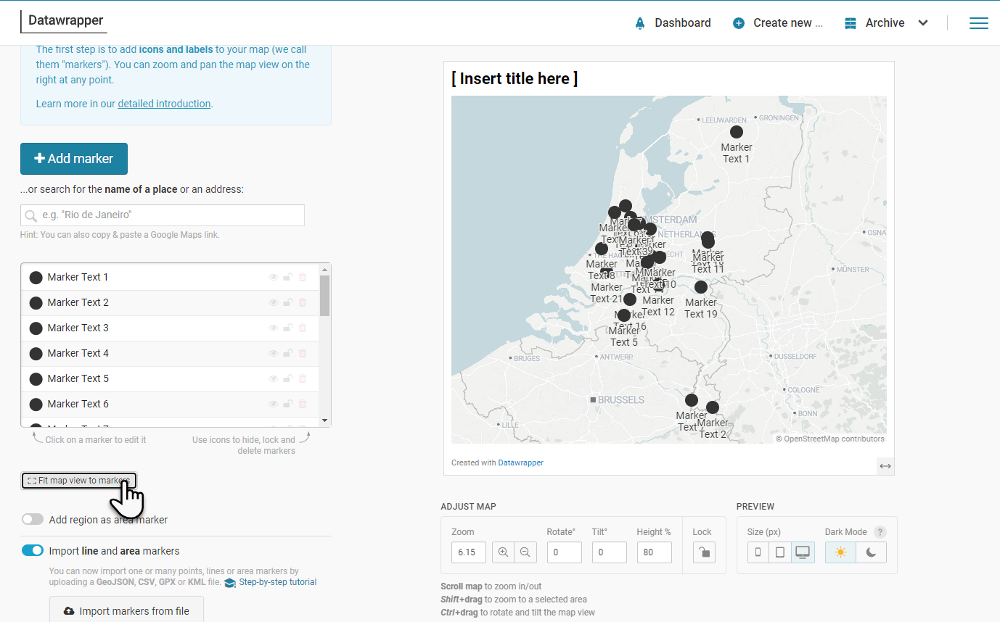

Adjust center and scale to bring the data into focus. Labels and icons are the default. You can update them for every marker. 

Enter a title for the map chart. Click on Proceed.

In this step, we can refine the map – show geographic details, (province) borders, roads? Show an inset (The Netherlands on a globe)? A scale indication?
Make the refinements you fancy. Or none to just quickly create the map.

Next step: set some map attributes (description, data source and URL, by line or author) and define the keys for the legend that clarifies the markers if you have defined different icon types or colors.

Then go to Publish and Embed like before to complete the definition of the map and make it available to external publication. 
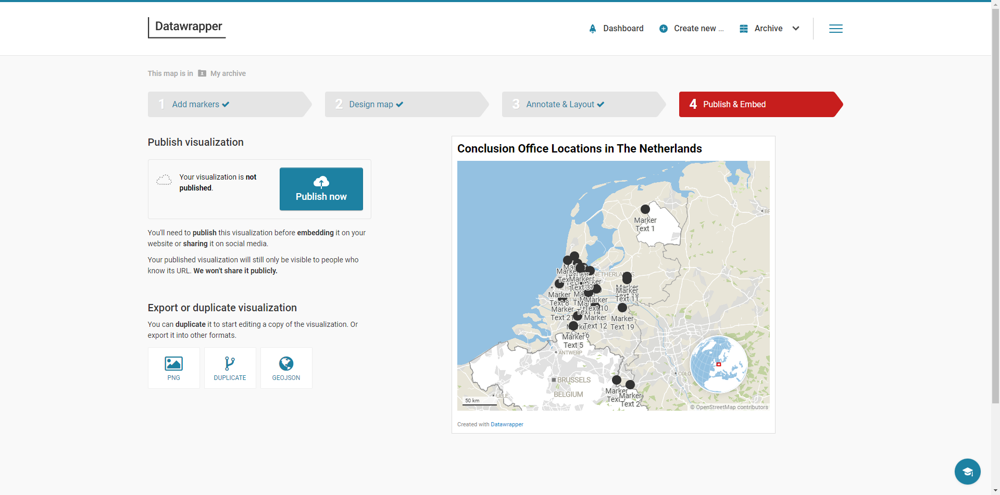


### Adding More Visual Clues to the Locator Map

We will now improve on the results from the previous step. We could manually change the appearance of each marker, but that is a lot of work. Instead, let's use the meta-data already present in the GeoJSON document. If we can provide that data to Data Wrapper [in the prescribed way](https://academy.datawrapper.de/article/177-how-to-style-your-markers-before-importing-them-to-datawrapper), it will be able to derive icon, color, size, label etc. from it .   

Follow the instructions in [this article](https://technology.amis.nl/data-analytics/prepare-custom-map-data-with-mapshaper-and-present-with-datawrapper/) to use **Mapshaper** to get a better prepared data file that is converted by Data Wrapper into a much nicer looking map. 

The result will look something like this:


## 3. Google MyMaps, Mapshaper & GeoJSON.io

To use Google MyMaps, you will need a Google account. If you have one, go to [MyMaps](https://www.google.com/maps/d/). Create a new map.
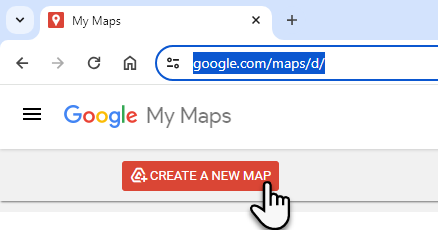

Acknowledge the message:
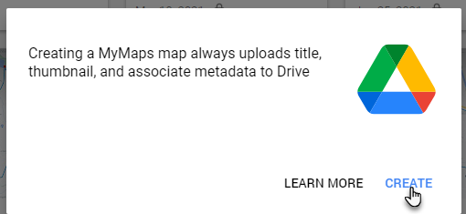
and click on create.

Edit the title of the map. Change it to for example "Dutch Sport Locations".

Click on import. Upload the file `dutch-sport-locations.csv` from the data files folder.

Select the `Address` column as the one to derive the geo coordinates from - using Geo Coding. Click Continue.

Select the `Stadium` column as the title for the markers. Click Finish.

The data from the csv file is processed. Addresses are geo coded and markers are put on the map for each of the records in the csv file. Click a marker to inspect its properties.

Click on *Uniform Style* in the layer definition. Click on Style by Column Definition and select column Capacity. Define 4 ranges - or any other number - and select the color palette. You may want to add labels as well. The markers on the map are now colored based on the stadium's capacity. If you want to organize a tournament, it is easy to find the accomodations that hold the largest crowds.


Click on Add Layer. 

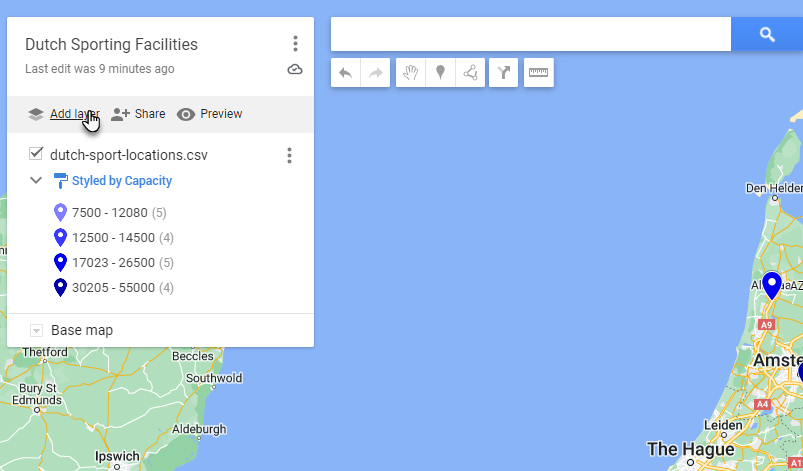
For the new, as yet untitled layer, click on import. 

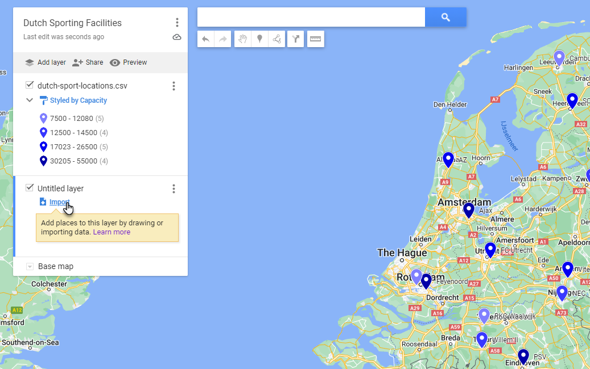

Upload the data file `dutch_keukenkampioen_divisie_stadiums.csv` . Select `Stadium Name` as the column to use for determining the coordinates. (yes, Google can do geocoding based on the name of the stadium). New markers are added to the map for this new layer:

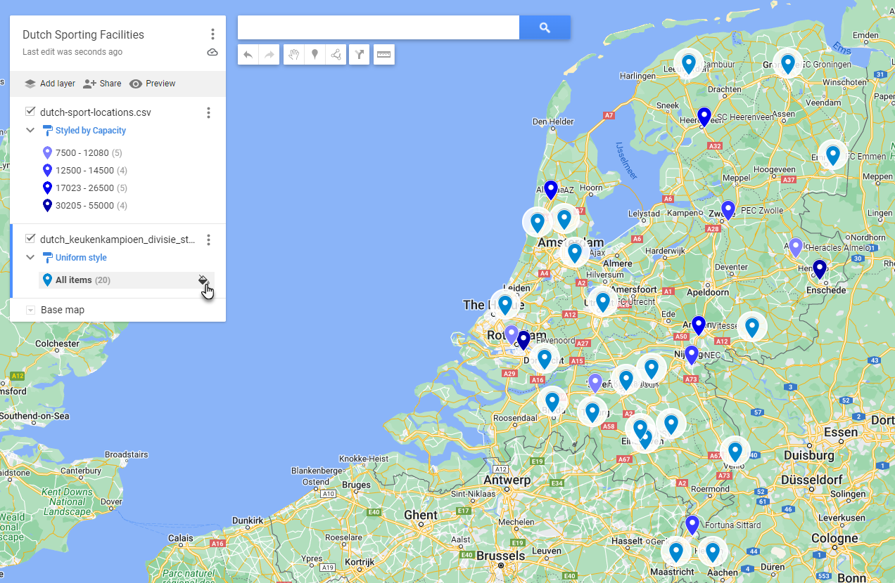
Click on the little paint can icon for All Items in the new layer.

Select a color for the markers in this layer.
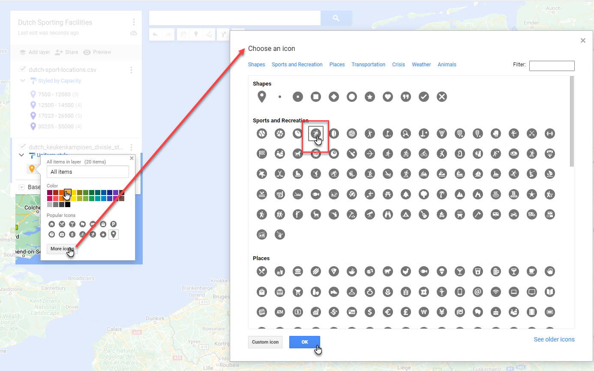
Then press *More icons* and select a suitable icon for these markers. Then Click OK.

The map should now look something like this:
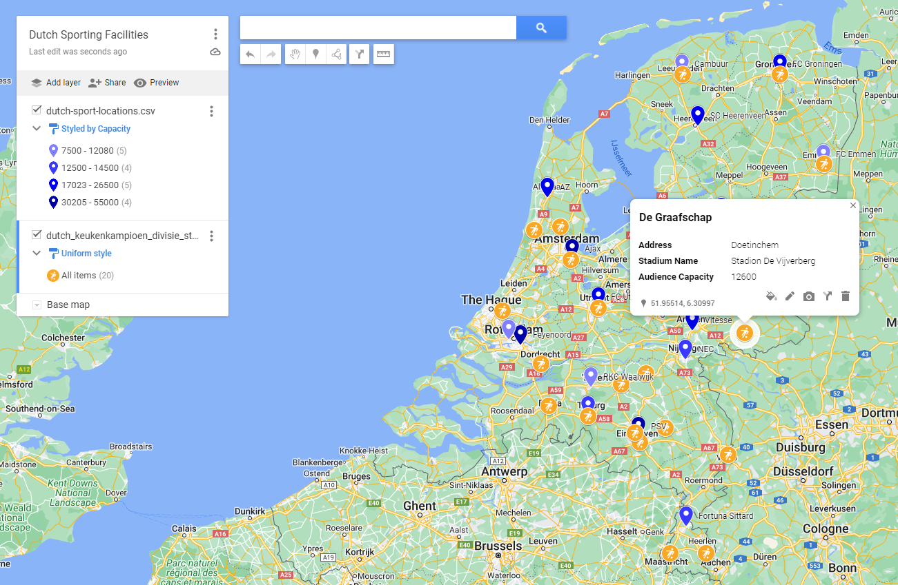

Note: you can easily decide to show and hide layers.

Note: you can choose the style of the base map. For example to hide features or accentuate others.
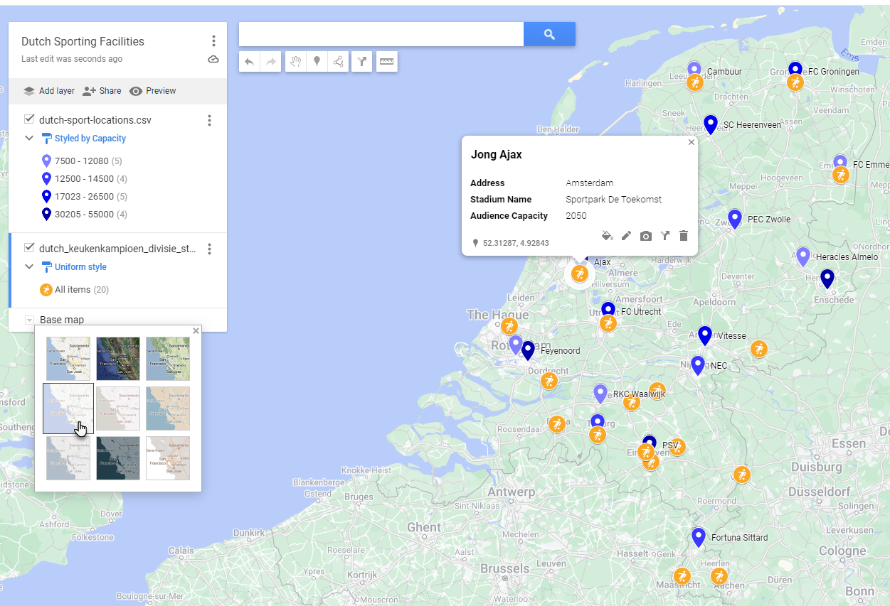

You can now publish and share your map. You can access the map I created at [this link](https://www.google.com/maps/d/edit?mid=1R4Q-1_4Paj4XXVWo1Rp3HQKV-8rNkmw&usp=sharing)
It looks like this:
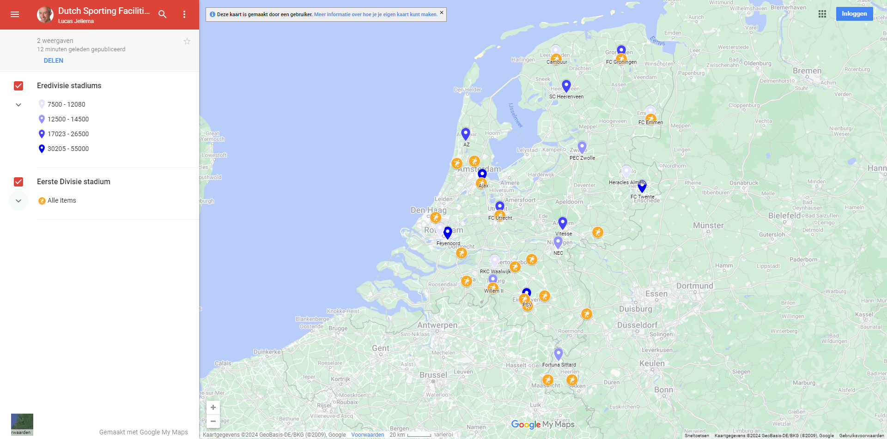

### Export to KML, Import in Data Wrapper

You can also export the data collected in the map as KML/KMZ file.
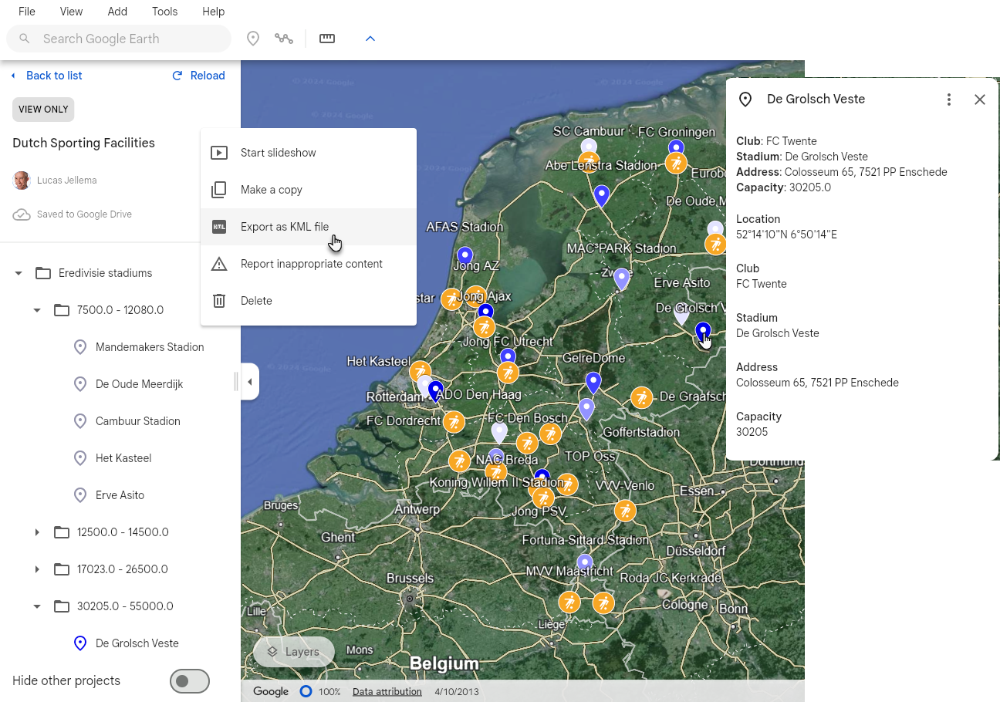

The MyMaps menu support *Export to KML/KMZ*. However, it turns out that this file does not contain the geocoordinates that were produced using geocoding.

In order to get a KML file that has the proper coorindates, we need an intermediate step. Pick the option *View in Google Earth*.
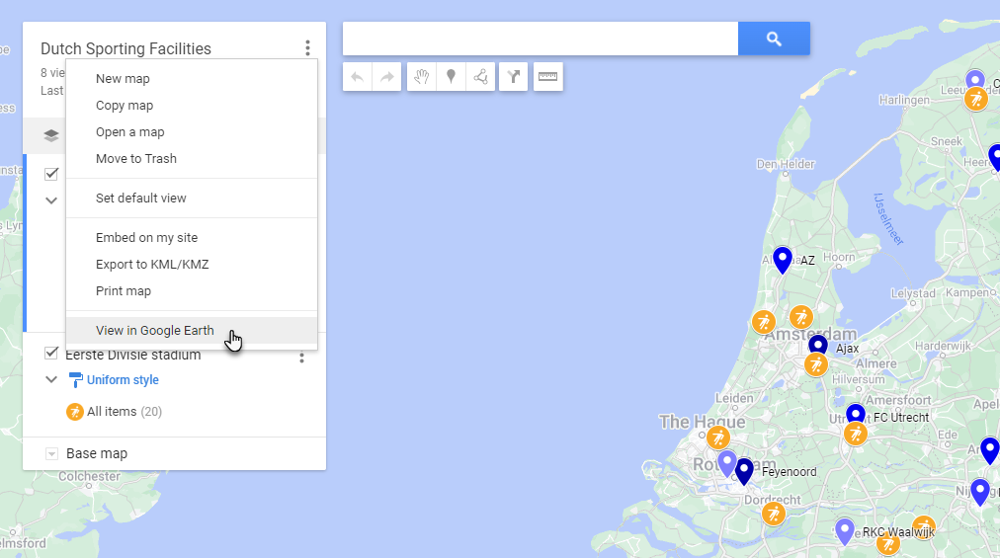


Google Earth opens and the markers are shown. Click on a marker to find the information on the stadium in tact.


Click on the three vertical dots next to the map name and select *Export as KML file* - or use the *File* menu. Save the KML file.

We can use this file without conversion in Data Wrapper to create a Locator map. Just like before, go to [Data Wrapper](https://www.datawrapper.de/maps), select Locator map as the type of map to create and import the KML file on the first step, *Add Markers*. 


After the file has been imported, the markers will show up - along with some meaningful meta data, including coloring and label:
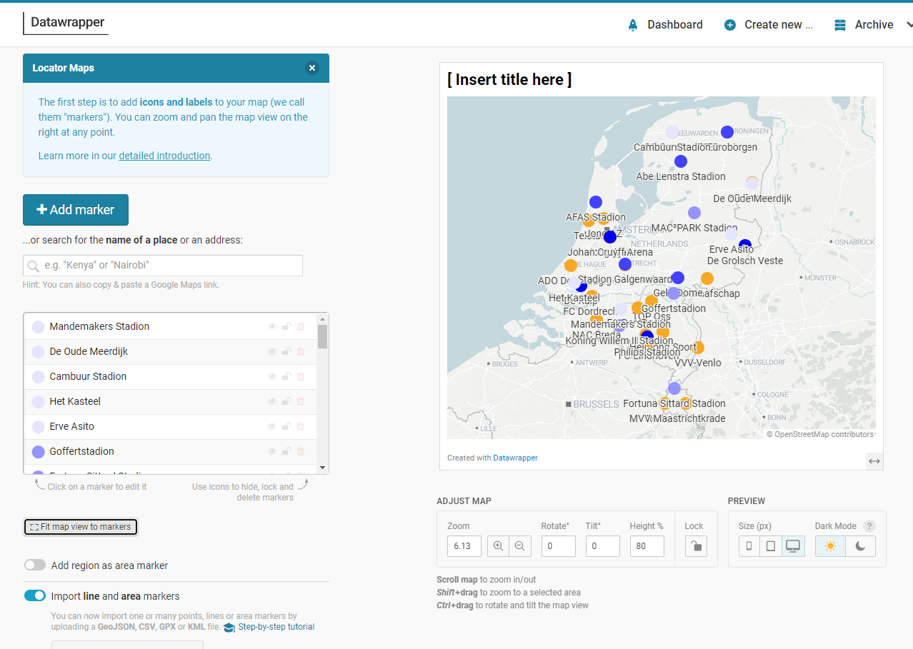


### MapShaper for Conversion, Analysis and Manipulation

We can use the site *MapShaper* to do some further work on the KML file - for example convert the data to GeoJSON format or combine the data with other files in different format. Or analyze, visualize and manipulate.

Navigate to [mapshaper.org](https://mapshaper.org/).

Click on *Select* to open the file browse and select dialog. Select the KML file exported from Google Earth.

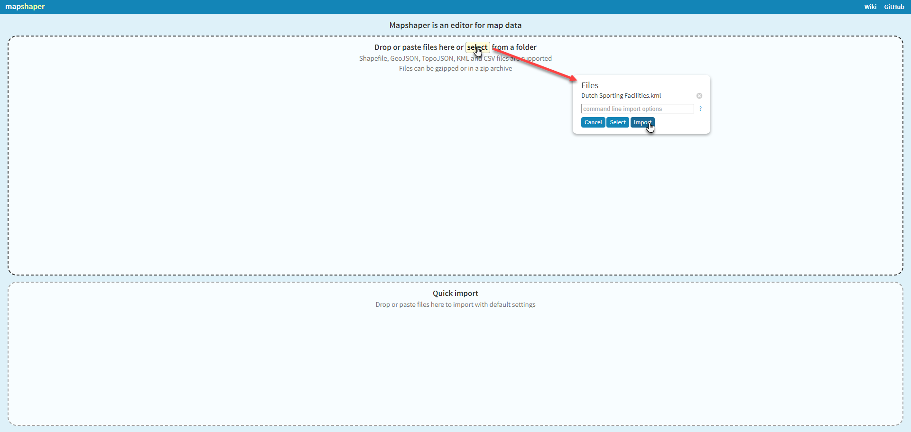

Click on *Import*.

What you will see on the screen may not look impressive. A number of dots. These however represent geo locations and a set of associated data.


If we add a base map, things will start to look a little bit better. Click on *Basemap*. Click on *Satellite* and on *Fade*. The result is:
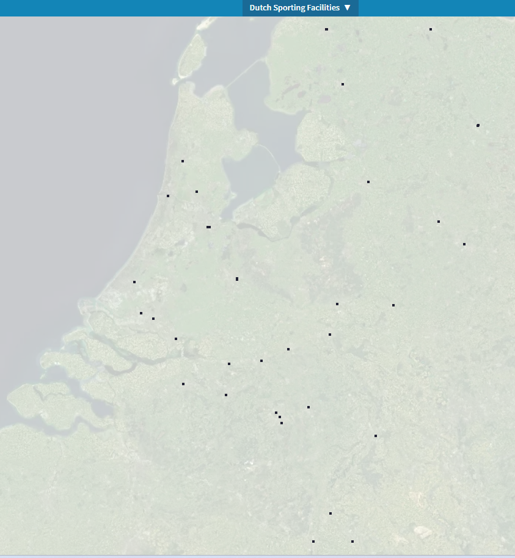

You can zoom and pan the display. However, *mapshaper* is not primarily a visualization tool.It is intended to wrangle geo data sets and export them in desired formats. 

Click on the Arrow icon in the toolbar on the right hand side. Enable *Inspect Feature*. Click on any marker on the map to see the details for the feature.
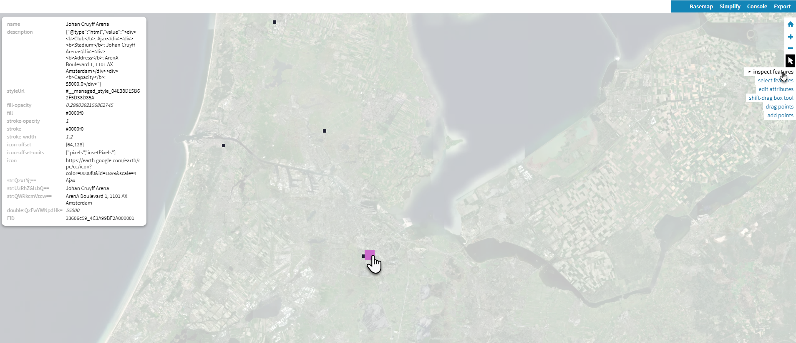

Using the Export menu, you can download the geo data in desired formats or paste data to the clipboard.
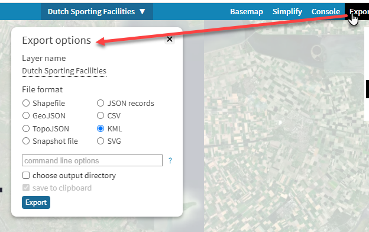

Each of these file types can be processed in different tools.

From the Mapshaper Console, you can further query and manipulate the data. See [documentation](https://github.com/mbloch/mapshaper/blob/master/REFERENCE.md) for details. Commands include affine, classify, clip, clean, dissolve, divide, drop, filter, join, merge, create points such as centroids, simplify, snap, split and more.


### John Snow's Cholera Incidents in London

Return to [MyMaps](https://www.google.com/maps/d/). Create a new map.

Import the data file pumps.kml from the `datafiles/john-snow` directory. Open the *Base Map* drop down and select the Light Landmass basemap. The map now looks like this:
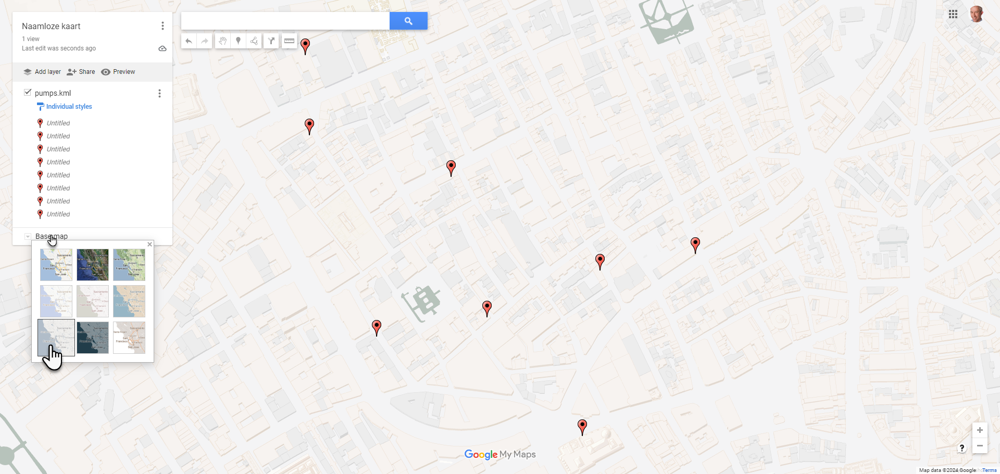

Create a new layer and import the data file `cholera-deaths.kml` from the `datafiles/john-snow` directory. 

Here is what the map with the two layers looks like:
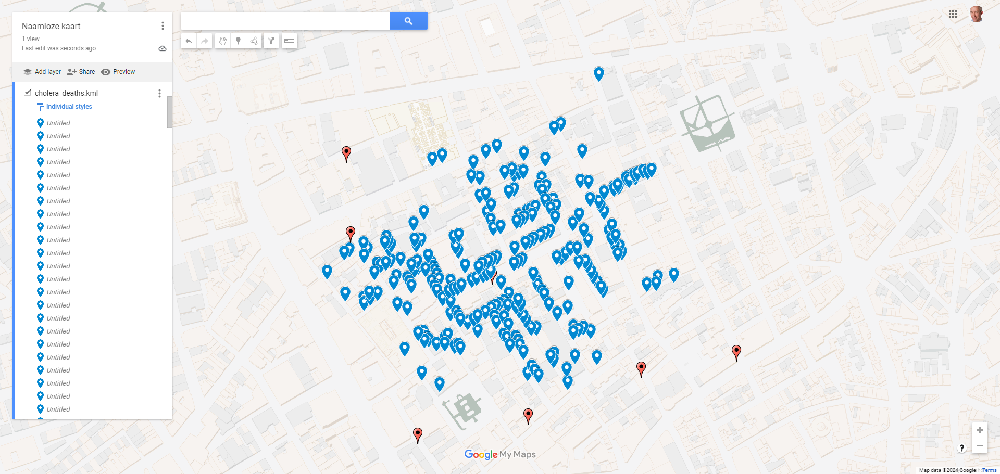

The pump that was identified as the source of the break out can hardly be seen because of the death markers. Something John Snow spotted and interpreted correctly.


## 4. Browse Public Geo Datasets

Check out websites

The Open Data Network - https://www.opendatanetwork.com/ - portal to find datasets from among 10Ks of public open data sets.

GISCO - the Geographic Information System of the COmmission - localise, analyse, visualise: https://ec.europa.eu/eurostat/web/gisco/geodata/reference-data . Within Eurostat, GISCO is responsible for meeting the European Commission's geographical information needs at 3 levels: the European Union, its member countries, and its regions.

The PDOK Viewer - Dutch open government data with current geo-information: Bij PDOK vind je open datasets van de overheid met actuele geo-informatie. Deze datasets zijn benaderbaar via geo webservices en beschikbaar als downloads. https://app.pdok.nl/viewer

UNdata - https://data.un.org/ - a world of information - data sets from United Nations on population, refugees, economy, education, labor, trade, energy, crime, health, science, environment, communication, transport and tourism.

Natural Earth is a public domain map dataset available at 1:10m, 1:50m, and 1:110 million scales. Featuring tightly integrated vector and raster data, with Natural Earth you can make a variety of visually pleasing, well-crafted maps with cartography or GIS software. Both vector (Shapefiles) and raster (TIFF) files.   https://www.naturalearthdata.com/
Some examples: countries, regions, cities, parks, administrative units. And: Coastline, rivers, reefs, bathymetry (deepness). Raster: elevation, bathymetry, gray-tone, relief, natural earth.

Copernicus - Satellite imagery available as raster (WMS/WMTS) - https://www.copernicus.eu/en/accessing-data-where-and-how/copernicus-services-catalogue -  

Worldbank Data Catalog - https://datacatalog.worldbank.org/home 

NASA EarthData - https://www.earthdata.nasa.gov/

GADM maps and data - provides maps and spatial data for all countries and their sub-divisions. https://gadm.org/data.html (GeoJSON, Shapefile,KMZ data files with boundaries of administrative units)


Download a particular data set
Check and Shape (and combine?) with mapshaper? 
Visualize in Datawrapper or MyMaps


## 5. QGIS - first steps


## 6. Playing with FotoMapp

Trying out https://lucasjellema.github.io/foto-map/ 

Upload images
Click to create markers
Click on marker - inspect popup
Paste GeoJSON

Copy GeoJSON (and paste in geojson.io or in Datawrapper)
Copy as Image

Filter by date
Clustering of closely located markers
Consolidate markers (check out the caroussel in the popup)

Edit mode:
Click to add marker
Drag Marker
Edit Marker/Site/Tooltip


Add custom map layer of tiled map service, for example of WARP-ed images/maps such as https://mapwarper.net/maps/tile/80272/{z}/{x}/{y}.png


## 7. First steps with Leaflet - integrating a map in a web application

If you want to integrate real world maps into your applications and provide interaction, zoom control, multiple layers and other fineries, you can do no better than use Leaflet. Leaflet is a well established, very popular and very easy to use JavaScript library for creating such maps inside your application, from the data manaed by your application and well interated with the events taking place inside your application.

We will now take a few quick first steps with Leaflet. Even if you are not a web application developer - of a developer of any kind - you can probably follow along.
For slightly more detail, check [Leaflet's Quick Start Documentation](https://leafletjs.com/examples/quick-start/)

Open the web site JSFiddle at https://jsfiddle.net/.


Paste the following HTML, CSS and JavaScript fragments in the designated areas.

### HTML - the structure and markup of the web page:
```
<!DOCTYPE html>
<html lang="en">

  <head>
    <base target="_top">
    <meta charset="utf-8">
    <meta name="viewport" content="width=device-width, initial-scale=1">
    <title>Quick Start - Leaflet</title>

    <link rel="shortcut icon" type="image/x-icon" href="docs/images/favicon.ico" />

    <link rel="stylesheet" href="https://unpkg.com/leaflet@1.9.4/dist/leaflet.css" integrity="sha256-p4NxAoJBhIIN+hmNHrzRCf9tD/miZyoHS5obTRR9BMY=" crossorigin="" />
    <script src="https://unpkg.com/leaflet@1.9.4/dist/leaflet.js" integrity="sha256-20nQCchB9co0qIjJZRGuk2/Z9VM+kNiyxNV1lvTlZBo=" crossorigin=""></script>

  </head>

  <body>
    <div id="map" style="width: 600px; height: 400px;"></div>
  </body>

</html>
```

### CSS: the styles (colors, sizes, fonts) of the objects in the page
```
	html,
	body {
	  height: 100%;
	  margin: 0;
	}

	.leaflet-container {
	  height: 400px;
	  width: 600px;
	  max-width: 100%;
	  max-height: 100%;
	}
```

### JavaScript: the code to actually create and initialize the map
```
const map = L.map('map').setView([52.07941, 5.14144], 13);

const tiles = L.tileLayer('https://tile.openstreetmap.org/{z}/{x}/{y}.png', {
  maxZoom: 19,
  attribution: '&copy; <a href="http://www.openstreetmap.org/copyright">OpenStreetMap</a>'
}).addTo(map);
```    


Now press the Run button in the upperleft hand corner. You should see a map - based on an OpenStreetMap baselayer, centered on Utrecht. It has no markers yet. You can pan and zoom. 


### Add Markers

Add a single marker for Utrecht Central Station. You can find the coordinates in several ways. Using geojson.io is probably the easiest (click and inspect the geojson data). Using Google Maps also works: right mouse click on the right location and at the top of the context menu are the coordinates (latitude, longitude); if you click on that first menu option, the coordinates are copied to the clipboard, ready to be pasted elsewhere.

Add this line at the end of the code section in the script panel in JSFiddle:

```
const marker = L.marker([52.08973650799466, 5.1098320811113505]).addTo(map);
```
and press Run. You should see the marker on the map:


The geo-coordinates of the marker are easily recognized in this statement:  52.08973650799466 (latitude), 5.1098320811113505 (longitude)


To allow users to get some useful information about a marker, we can add a popup to it: a balloon text that opens when the marker is clicked. Add this line to the end of the JavaScript section:
```
marker.bindPopup(`<b>Utrecht Central Station<\/b><br>3511 CA Utrecht. Zie: <a href="https:\/\/www.ns.nl\/uitgelicht\/bestemmingen\/utrecht">Reisinformatie van NS<\/a>.`).openPopup();
```

And press Run again. When you now click on the marker, a popup appears:


Leaflet supports GeoJSON. We can easily add markers for all point features in a GeoJSON document.

In order to add all Conclusion office locations, add this next snippet of code, again at the bottom of the JavaScript section. It will load the GeoJSON document with Conclusion offices from a GitHub repository. Once the document is retrieved, the contents is used to create a new GeoJSON layer that is then added to the map.

```
const geojsonUrl = "https://raw.githubusercontent.com/lucasjellema/visualization-netherlands-and-conclusion-locations/main/conclusion-offices-geojson.json"
// Fetch the GeoJSON file
fetch(geojsonUrl)
  .then(response => {
    // Check if the request was successful
    if (!response.ok) {
        throw new Error('Network response was not ok');
    }
    return response.json(); // Parse the response body as JSON
  })
  .then(geojsonData => {
    // Create a GeoJSON layer and add it to the map
    L.geoJSON(geojsonData, {
      // Optionally, specify a style or onEachFeature function here
      // For example, to set the style of polygons:
      style: function (feature) {
        return {color: feature.properties.color};
      },
      // To add popups to features:
      onEachFeature: function (feature, layer) {
        if (feature.properties && feature.properties.popupContent) {
          layer.bindPopup(feature.properties.popupContent);
        }
      }
    }).addTo(map);
  })
  .catch(error => {
    console.error('Error fetching the GeoJSON data:', error);
  });
```

Press Run. The map - when propertly zoomed out - should now show markers for all offices locations of the Conclusion ecosystem - inside The Netherlands. 


### Bonus: Add WARPed Map

If you have created a WARPed map from a custom image - or you reuse someone else's handywork - you can include that layer easily in the Leaflet map. You need the url for the tiled map for this. For maps on MapWarper, this URL should be something like  https://mapwarper.net/maps/tile/xxx/{z}/{x}/{y}.png where xxx is the identification of the map.

For example to add the warped map for the plan of Galgenwaard Stadium (home of FC Utrecht) we can use URL:  https://mapwarper.net/maps/tile/80272/{z}/{x}/{y}.png

Add this next line of code - using your own URL - to the JavaScript section:

```
L.tileLayer('https://mapwarper.net/maps/tile/80272/{z}/{x}/{y}.png', {attribution: '&copy; <a href="https://www.https://mapwarper.net">mapwarper.net</a> '}).addTo(map);
```

Press Run.

Your custom warped map is now included:

